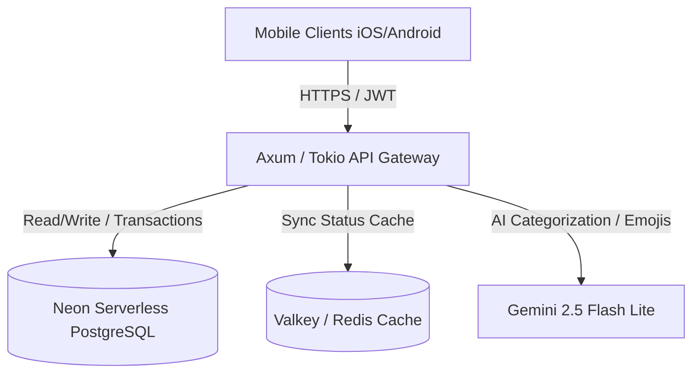

# teddy.fyi Sync API & Backend Service

This is the centralized, high-performance Sync Gatekeeper and source of truth backend service for the **teddy.fyi** ecosystem. Built with Rust, it manages multi-tenant, collaborative, local-first data streams (e.g., shared household grocery lists and private todo lists) for both iOS and Android clients.

---

## 🏗 System Architecture & Tech Stack



- **Web Framework**: [Axum](https://github.com/tokio-rs/axum) with [Tokio](https://tokio.rs/) for high-concurrency async performance.
- **Database**: [PostgreSQL (Neon)](https://neon.tech/) with [SQLx](https://github.com/launchbadge/sqlx) for type-safe queries and database migrations.
- **Cache**: [Valkey / Redis](https://valkey.io/) to cache sync states, enabling fast, low-overhead sync check-ins.
- **AI Integrations**: [Gemini API](https://ai.google.dev/) (specifically `gemini-2.5-flash-lite`) for automated grocery item categorization and todo list emoji/icon generation.
- **Auth**: Google OAuth & JWT (JSON Web Tokens) with secure cookie-based session management.

---

## ⚡ Core Features

### 1. Atomic Sync Protocol (`POST /api/sync`)
Exposes a single endpoint to reconcile state changes between the local database on devices (SQLite/Room) and the server's Postgres database:
- **Permission Check**: Validates that the requesting `user_id` has access to the target list (e.g., shared lists require list membership).
- **Conflict Detection (MVCC & LWW)**: 
  - Compares incoming `client.version` against `server.version`.
  - Increments version numbers upon matching version edits.
  - Resolves conflicts using Last-Write-Wins (LWW) if versions mismatch, forcing clients to align with the bumped server version.
- **Echo Prevention**: Filters out database updates that originated from the requesting client (`client_id`) to save bandwidth.

### 2. Fast Sync Check (`GET /api/sync/status`)
A lightweight endpoint that client apps hit on startup to determine if a full sync is necessary:
- Uses a Redis/Valkey cache containing user-scoped `last_update` timestamps.
- Falls back to database aggregate queries on cache misses.

### 3. AI-Powered Smart Helpers
- **Item Auto-Categorization (`POST /api/categorize`)**: Automatically maps new grocery item titles (e.g., *"organic whole milk"*) to a user's customized categories (or standard fallback categories like *"Dairy"*).
- **Todo Emojis (`POST /api/assign-icon`)**: Inspects todo titles and returns a highly relevant emoji or icon token to display next to the task.

---

## 📁 Module Layout & Development Standards

This repository strictly adheres to modern Rust codebase standards.

> [!IMPORTANT]
> **No `mod.rs` files**: We follow the modern Rust file-based module layout. Sibling submodules of `routes.rs` are defined in a sibling `routes/` folder. All module entry files (e.g. `routes.rs`, `auth.rs`, `sync.rs`) are declarative and contain only `pub mod` and `pub use` statements. No handler logic or unit tests belong in these file-based entrypoints.

---

## 🛠 Setup & Local Development

### Prerequisites
- [Rust toolchain](https://rustup.rs/) (managed automatically via `make init`)
- [Docker](https://www.docker.com/) (for running local Redis/Valkey)
- [NodeJS / npm](https://nodejs.org/) (for installing and running `neonctl`)

### 1. Environment Configuration
Create a `.env` file from the template:
```bash
cp .env.example .env
```
Ensure you have the following environment variables configured:
* `DATABASE_URL`: Connection string to your database.
* `JWT_SECRET`: Secret key used for signing JWTs.
* `GEMINI_API_KEY`: API key for accessing Gemini services.

### 2. Run with Automated Dev Script
The easiest way to start development is to run:
```bash
make dev
```
The underlying development script ([scripts/dev.sh](file:///Users/teddymartin/src/teddy-fyi-api-rust/scripts/dev.sh)) handles the following tasks:
1. Retrieves your active Neon project ID using `neonctl`.
2. Cleanly deletes any expired, orphaned developer branches.
3. Automatically provisions a temporary database branch (`dev-<username>-<timestamp>`) cloned from your production branch.
4. Generates connection strings configured with statement caching options tuned for PgBouncer compatibility (`statement_cache_size=0`).
5. Configures your local `.env` file with the connection string.
6. Boots up a local Redis/Valkey Docker container (`teddy-redis-dev`) if it's not already running.
7. Automatically applies all database migrations in `/migrations`.
8. Starts the Axum server using `cargo watch` for hot-reloading (falls back to `cargo run` if not installed).

---

## 📋 Makefile Commands Reference

Run these commands from the project root:

| Command | Action |
| :--- | :--- |
| `make init` | Installs the Rust toolchain |
| `make install` | Fetches Cargo dependencies |
| `make build` | Compiles the release/debug binary locally |
| `make run` | Starts the server locally |
| `make dev` | Spins up the branch databases, Redis container, and runs hot-reloaded dev server |
| `make test` | Executes the unit/integration test suite |
| `make prepare` | Prepares SQLx offline metadata cache for offline compiler verification |
| `make docker-build` | Builds the Docker production image |
| `make docker-run` | Runs the API container on port `8080` |
| `make clean` | Cleans up the target directory |

---

## 🔌 API Endpoint Documentation

### Authentication
All routes under `/api` require Google OAuth or JWT authorization.
- `POST /auth/login` - Exchanges a Google OAuth token for access/refresh tokens.
- `POST /auth/refresh` - Renews an expired access token.
- `POST /auth/logout` - Revokes current session cookies.

### Sync Endpoints
#### `GET /api/sync/status`
Checks if the client needs to fetch new updates from the server.
- **Query Parameters**:
  - `last_synced_at` (optional): RFC 3339 formatted timestamp (e.g., `2026-06-18T18:34:46Z`).
  - `scope` (optional): `ALL`, `GROCERY`, or `TODO`.
- **Response (`200 OK`)**:
  ```json
  {
    "needs_sync": true,
    "latest_version": "2026-06-18T18:35:00Z"
  }
  ```

#### `POST /api/sync`
Main synchronization payload reconciling local changes with remote updates.
- **Request Body**:
  ```json
  {
    "last_synced_at": "2026-06-18T18:00:00Z",
    "client_id": "client-uuid-here",
    "scope": "ALL",
    "todoListChanges": [],
    "todoChanges": [
      {
        "id": "todo-task-uuid",
        "type": "UPDATE",
        "version": 2,
        "data": {
          "id": "todo-task-uuid",
          "title": "Buy groceries",
          "isCompleted": true,
          "createdAt": 1718000000000,
          "position": 1,
          "scheduledAt": 1718000000000,
          "priority": 0,
          "sync_state": "SYNCED",
          "version": 2,
          "is_deleted": false
        }
      }
    ],
    "groceryListChanges": [],
    "groceryListMemberChanges": [],
    "storeChanges": [],
    "categoryChanges": [],
    "groceryChanges": [],
    "groceryItemStoreInfoChanges": []
  }
  ```
- **Response (`200 OK`)**:
  ```json
  {
    "success_ids": ["todo-task-uuid"],
    "upload_status": [
      {
        "id": "todo-task-uuid",
        "version": 3,
        "sync_state": "SYNCED"
      }
    ],
    "remote_todo_list_changes": [],
    "remote_todo_changes": [],
    "remote_grocery_list_changes": [],
    "remote_grocery_list_member_changes": [],
    "remote_store_changes": [],
    "remote_category_changes": [],
    "remote_grocery_changes": [],
    "remote_grocery_item_store_info_changes": [],
    "server_timestamp": "2026-06-18T18:35:00Z"
  }
  ```

### AI Helper Endpoints
#### `POST /api/categorize`
Categorize a grocery item name into specific user categories.
- **Request Body**:
  ```json
  {
    "item_title": "organic whole milk"
  }
  ```
- **Response (`200 OK`)**:
  ```json
  {
    "category": "Dairy"
  }
  ```

#### `POST /api/assign-icon`
Generates an appropriate icon/emoji for a todo item title.
- **Request Body**:
  ```json
  {
    "todo_title": "Schedule dental appointment"
  }
  ```
- **Response (`200 OK`)**:
  ```json
  {
    "emoji_or_asset_token": "🦷"
  }
  ```
